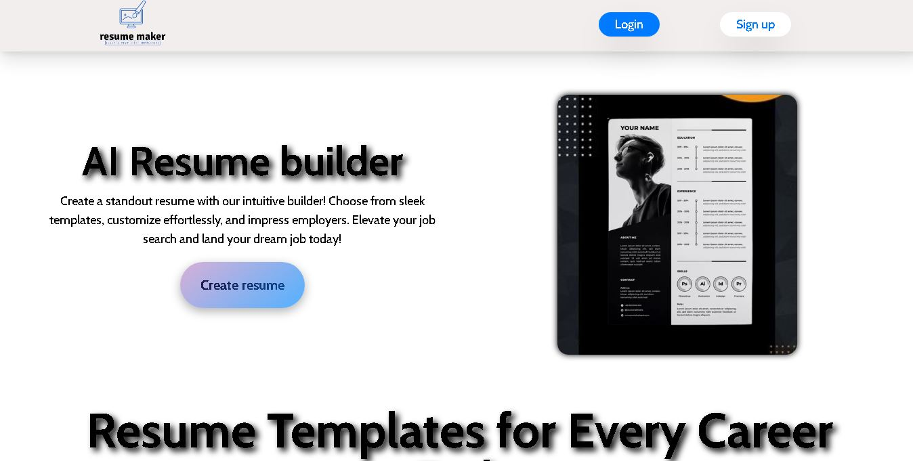
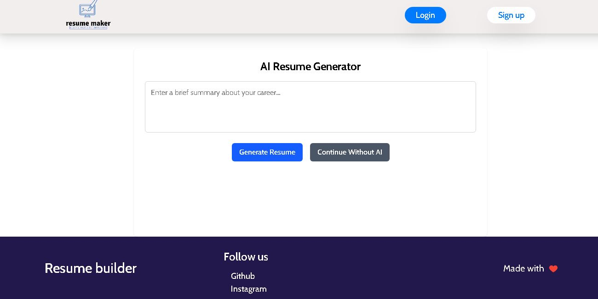
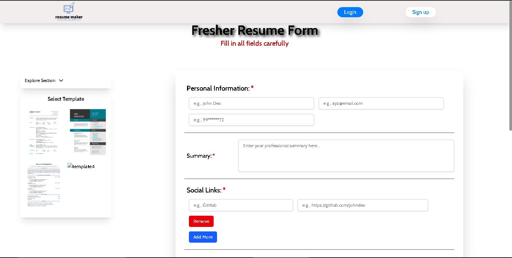

# 🧑‍💼 Resume Builder

A modern, responsive, AI-assisted resume builder where users can either **manually fill their details** or **generate resume content using AI** by entering a prompt. It supports multiple professional templates, real-time preview, and PDF export.

---

## 🚀 Features

- 🎨 Multiple Resume Templates (Fresher, Experienced, Microsoft-style)
- 🤖 AI-Powered Auto Resume Generator (Spring Boot + Spring AI integration)
- 📄 Download as PDF with `reactToPrint` and `window.print`
- ⚡ Built with **React + Vite** for ultra-fast performance
- 🧠 Smart Form Auto-Fill using OpenAI/Spring AI backend
- 📱 Fully Responsive

---

## 📸 Screenshots

| Manual Editor Page | AI Prompt Page | Resume Preview |
|--------------------|----------------|----------------|
|  |  |  |

---

## 🛠️ Tech Stack

- **Frontend:**
  - React.js + Vite
  - Tailwind CSS
  - ShadCN UI
  - AOS for scroll animations
  - reactToPrint & window.print for PDF downloads

- **Backend (optional):**
  - Spring Boot
  - Spring AI (to handle prompts and generate structured resume JSON)

---

